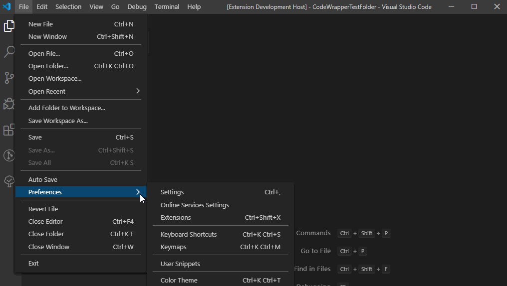
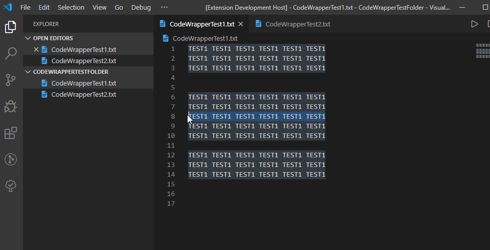
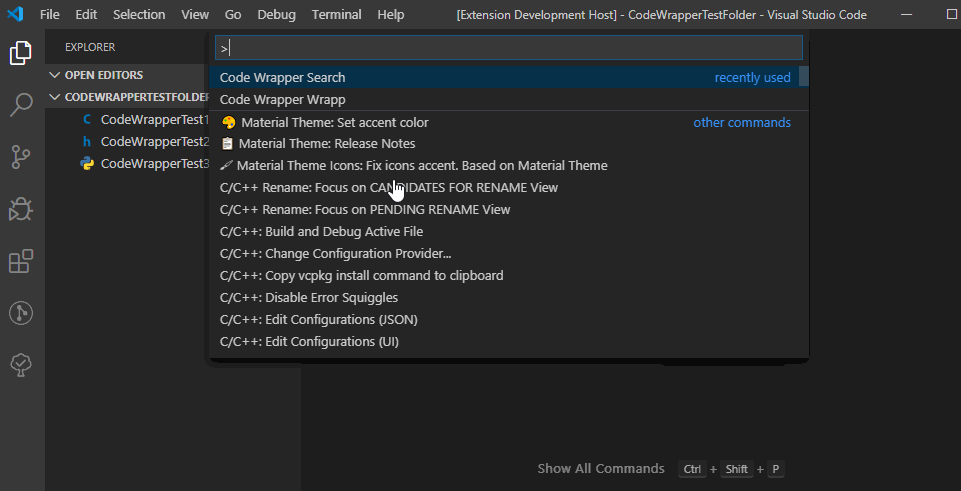
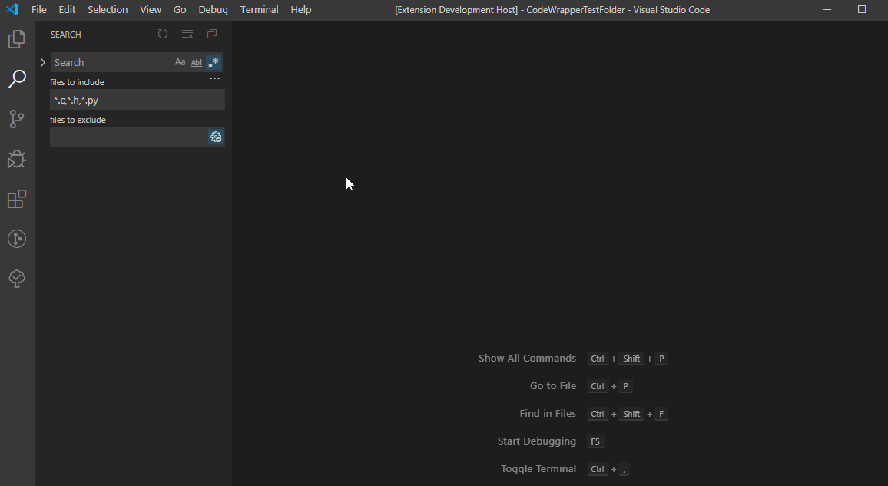

# CodeWrapper for Visual Studio Code

Extension gives you option to define start and end comments that will be inserted around selected code.

## Features

* Define custom comments
* Wrapp the code
* Search folder for predefined regex
* Create log file based on current search results

## Future Planed Features

* Opened for suggestions

## Usage
### Define start and end comments
**Note**: If not defined by user the default settings will be used

This extension contributes the following settings:

* `codeWrapper.wrapperStart`: define the start comment or the default one will be used
* `codeWrapper.wrapperEnd`: define the end comment or the default one will be used
* `codeWrapper.wrapperStartPython`: define the start comment or the default one will be used
* `codeWrapper.wrapperEndPython`: define the end comment or the default one will be used
* `codeWrapper.wrapperSearchExpression`: define the end comment or the default one will be used
* `codeWrapper.wrapperSearchFileTypes`: define the end comment or the default one will be used

### Wrapp the code
**Note**: If not defined by user the default settings will be used

### Search folder for wrapp
**Note**: If not defined by user the default settings will be used

### Create log file based on search results
**Note**: The file need to be saved in desired location (default is opened folder)

## Keyboard Shortcuts

This extension defines the following keyboard shurcuts:

* Code Wrapp `Ctrl+Alt+W`
* Code Wrapp Python `Ctrl+Alt+P`
* Code Wrapp Search `Ctrl+Alt+S`
* Code Wrapp Log `Ctrl+Alt+L`

They can be redefined, more at [Visual Studio Code Keybindings](https://code.visualstudio.com/docs/getstarted/keybindings).

## Release Notes

### 0.0.7

Initial release of Code Wrapper

**Enjoy!**
