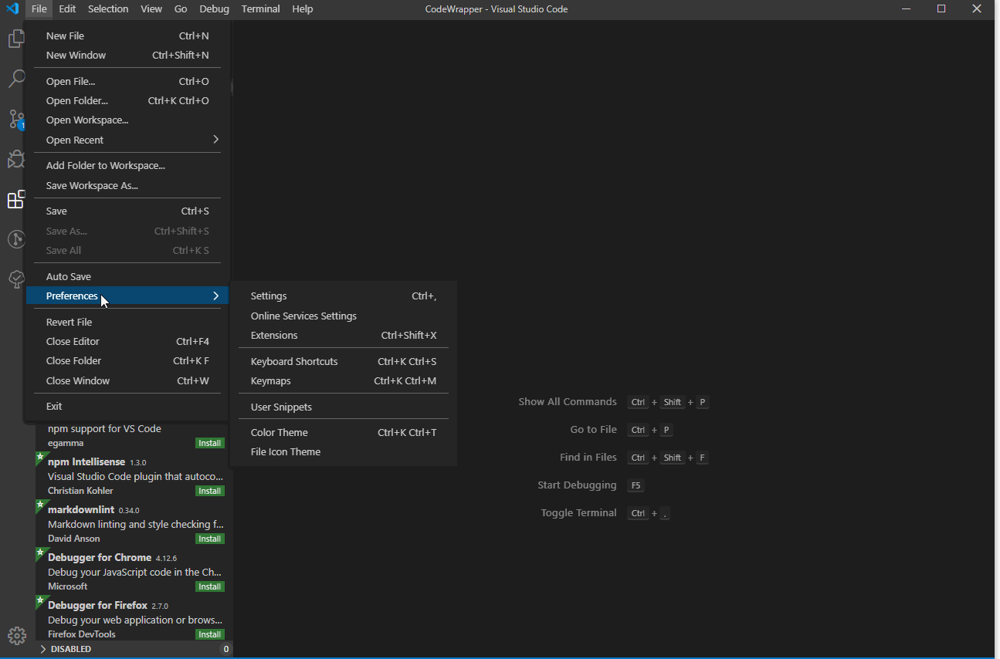

# CodeWrapper for Visual Studio Code

Extension gives you option to define start and end comments that will be inserted around selected code.

## Features

* Define custom comments
* Wrapp the code
* Search folder for predefined regex

## Future Planed Features

* Create log file with the list of the documents were the comments are applied.

## Usage
### Define start ans end comments
**Note**, if not defined by user the default ones will be used

This extension contributes the following settings:

* `codeWrapper.wrapperStart`: define the start comment or the default one will be used
* `codeWrapper.wrapperEnd`: define the end comment or the default one will be used
* `codeWrapper.wrapperStartPython`: define the start comment or the default one will be used
* `codeWrapper.wrapperEndPython`: define the end comment or the default one will be used
* `codeWrapper.wrapperSearchExpression`: define the end comment or the default one will be used
* `codeWrapper.wrapperSearchFileTypes`: define the end comment or the default one will be used

### Wrapp the code
**Note**, if not defined by user the default ones will be used

### Search folder for wrapp

## Release Notes

### 0.0.4

Initial release of Code Wrapper

**Enjoy!**
